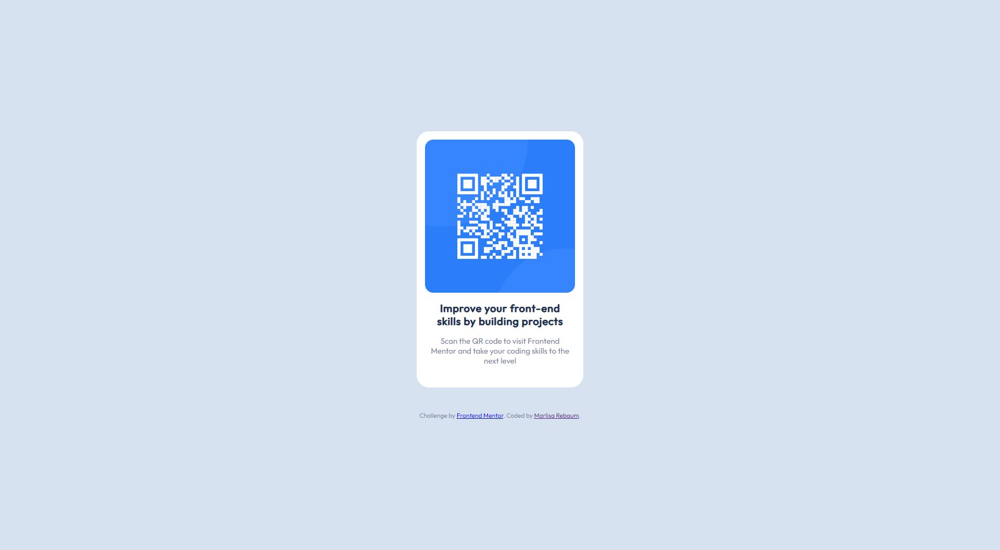
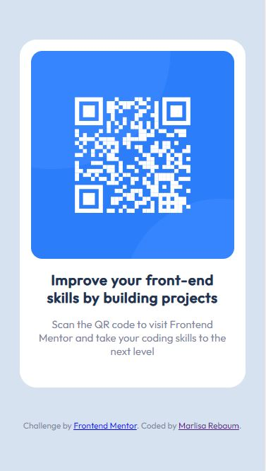

# Frontend Mentor - QR code component solution

This is a solution to the [QR code component challenge on Frontend Mentor](https://www.frontendmentor.io/challenges/qr-code-component-iux_sIO_H). Frontend Mentor challenges help you improve your coding skills by building realistic projects. 

## Table of contents

- [Overview](#overview)
  - [Screenshot](#screenshot)
  - [Links](#links)
- [My process](#my-process)
  - [Built with](#built-with)
  - [What I learned](#what-i-learned)
- [Author](#author)

## Overview

### Screenshot

Desktop design provided by Frontend Mentor:

Screenshot of my desktop design:

Mobile design provided by Frontend Mentor:

Screenshot of my mobile design:

### Links

- Solution URL: [https://www.frontendmentor.io/solutions/responsive-qr-code-component-using-html-and-css-7YaFgV_BHv](https://www.frontendmentor.io/solutions/responsive-qr-code-component-using-html-and-css-7YaFgV_BHv)
- Live Site URL: [https://marlisarebaum.github.io/flexbox-QR-code/](https://marlisarebaum.github.io/flexbox-QR-code/)

## My process

### Built with

- Semantic HTML5 markup
- CSS custom properties
- Flexbox

### What I learned

In this project, I practiced using flexbox to create more responsive websites.

## Author

- LinkedIn - [Marlisa Rebaum](https://www.linkedin.com/in/marlisarebaum/)
- Frontend Mentor - [@marlisar](https://www.frontendmentor.io/profile/marlisar)